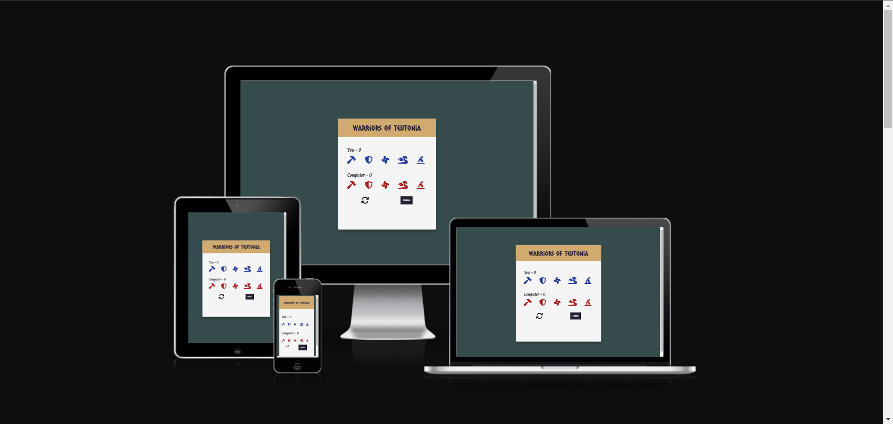
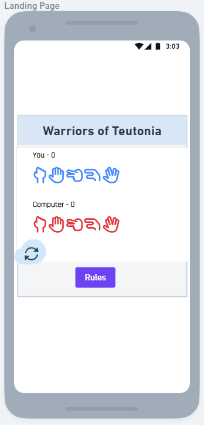
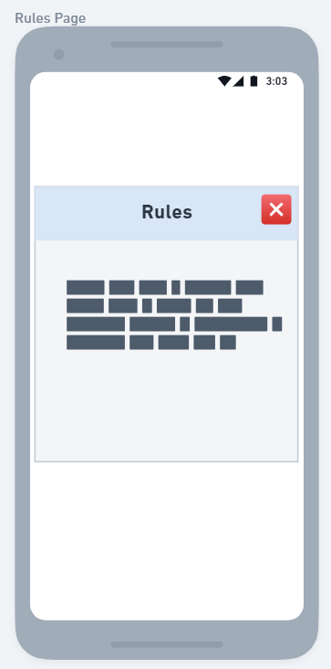
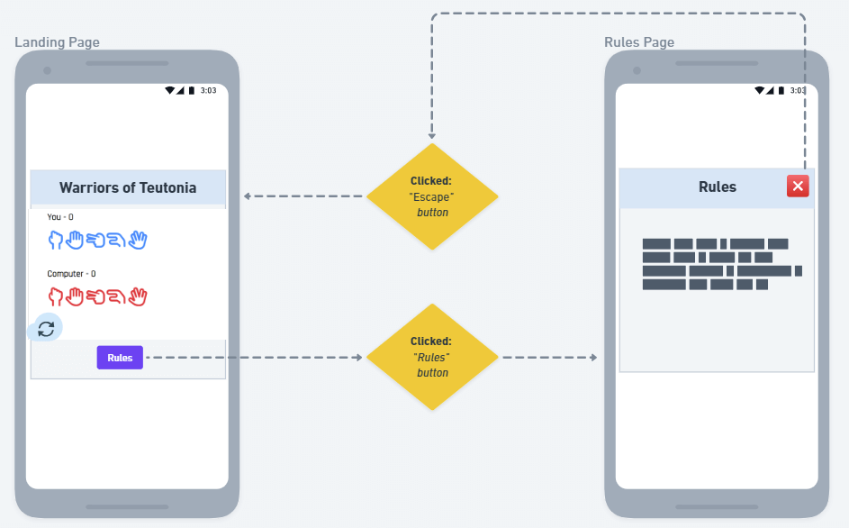

# Warriors of Teutonia

"Warriors of Teutonia" is an interactive video game set in a mythical kingdom. Player picks  one of five tribes, each with unique strengths and weaknesses, to compete for supremacy each round. The game's engaging rules are inspired by Rock, Paper, Scissors, Lizard, Spock. It's a Code Institute project, showcasing interactive HTML, CSS, and JavaScript use.

View the live site [here](https://blignaut24.github.io/warriors_of_teutonia/).

## Content
# Table of Content

- [The Children's Book Picker](#the-childrens-book-picker)
- [Table of Content](#table-of-content)
  - [User Experience (UX)](#user-experience-ux)
    - [Site Purpose](#site-purpose)
      - [Are you struggling to find high-quality children's books to read to your little ones?](#are-you-struggling-to-find-high-quality-childrens-books-to-read-to-your-little-ones)
    - [Site Goals:](#site-goals)
    - [Audience:](#audience)
    - [Communication:](#communication)
    - [Current User Goals:](#current-user-goals)
    - [New User Goals:](#new-user-goals)
    - [**Future Goals:**](#future-goals)
  - [Design](#design)
    - [Wireframe:](#wireframe)
  - [Features](#features)
    - [Existing Features:](#existing-features)
    - [Landing Page:](#landing-page)
    - [List all Books](#list-all-books)
    - [The Random Book Picker](#the-random-book-picker)
    - [Search](#search)
    - [**Features Left to Implement**](#features-left-to-implement)
  - [Testing](#testing)
    - [Validator Testing](#validator-testing)
    - [Manual Testing](#manual-testing)
    - [Unfixed Bugs](#unfixed-bugs)
  - [Technologies Used](#technologies-used)
    - [Main Languages Used](#main-languages-used)
  - [Deployment and Development](#deployment-and-development)
    - [Deploying the App](#deploying-the-app)
    - [Forking The Repository](#forking-the-repository)
    - [Cloning The Repository](#cloning-the-repository)
  - [Credits](#credits)
  - [Acknowledgements](#acknowledgements)

## User Stories

- Engage in a single player game that relies on luck.
- Experience a unique game as simple and straightforward as rock paper scissors.
- Feel compelled to start playing the game as soon as the page loads.
- Navigate through a user-friendly interface.
- Easily understand the rules and gameplay mechanics.
- Receive immediate feedback on game results (win, loss, or draw).
- Play a game that maintains a score tally.

## Site Structure

The website consists of a single page that presents the main menu. The game rules are displayed when the rules button is selected, using a JavaScript modal for presentation.

## Wireframes & Wireflows

The design process utilized [Whimsical](https://whimsical.com/home) to create both wireframes and wireflows, following a mobile-first approach.

#### Wireframes:

### Wireflows:

## Design Choices

### Typography

The chosen typography was designed to evoke a primitive and tribal atmosphere in the game.

- Title: "Caesar Dressing"
- Sub-title: "Jim Nightshade"
- Main-font: "Andika"
- Result-text: "Rancho"
- Backup font: “Serif”

### Color

The color palette was chosen to enhance the primitive and tribal theme portrayed through the typography. Furthermore, specific colors were selected for their ability to provide clear information to the user. For instance, the color #7e0684 was used to highlight the selections made by both the player and the computer.

### Icons

- The Barbarian's favicon was used to enhance user experience, branding, and professionalism.

- The player and computer reset icons are sourced from FontAwesome. They are visually appealing, load faster than images, which improves page load times, and are scalable without losing quality. This ensures they appear sharp on all devices and screen sizes.

