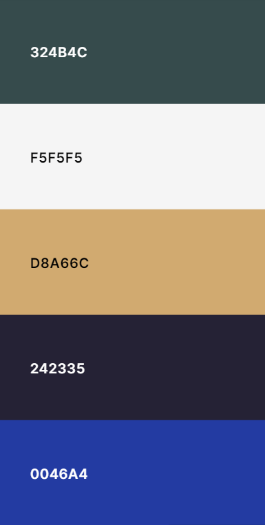
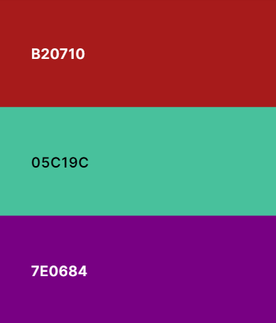
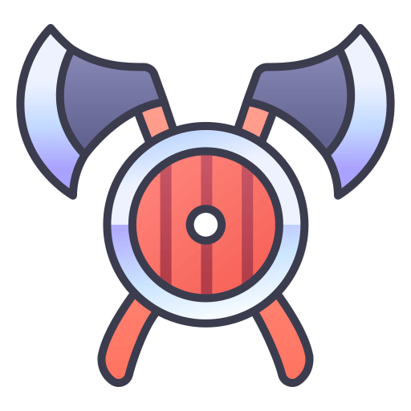
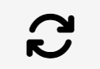
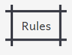
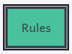

# Warriors of Teutonia

"Warriors of Teutonia" is an interactive video game set in a mythical kingdom. Player picks  one of five tribes, each with unique strengths and weaknesses, to compete for supremacy each round. The game's engaging rules are inspired by Rock, Paper, Scissors, Lizard, Spock. It's a Code Institute project, showcasing interactive HTML, CSS, and JavaScript use.

View the live site [here](https://blignaut24.github.io/warriors_of_teutonia/).

## Content
# Table of Content

- [Warriors of Teutonia](#warriors-of-teutonia)
  - [Content](#content)
- [Table of Content](#table-of-content)
  - [User Stories](#user-stories)
  - [Site Structure](#site-structure)
  - [Wireframes \& Wireflows](#wireframes--wireflows)
      - [Wireframes:](#wireframes)
    - [Wireflows:](#wireflows)
  - [Design Choices](#design-choices)
    - [Typography](#typography)
    - [Color](#color)
    - [Icons](#icons)
    - [Button](#button)
      - [Non-Hover](#non-hover)
      - [Hover](#hover)
  - [Existing Features](#existing-features)
    - [favicon](#favicon)
    - [Heading](#heading)
    - [Player \& Computer  Panel](#player--computer--panel)
    - [Score Board](#score-board)
    - [Selected: Icon \& Text](#selected-icon--text)
    - [Reset Icon](#reset-icon)
    - [Rules Button](#rules-button)
    - [Text Display: Win, Lose or Draw](#text-display-win-lose-or-draw)
    - [Confetti](#confetti)
    - [Rules - Modal](#rules---modal)
    - [Gameplay Diagram](#gameplay-diagram)
    - [Bullet Point Rules](#bullet-point-rules)
    - [Exit button - Rule Modal](#exit-button---rule-modal)
  - [Future Features](#future-features)
  - [Technologies Used](#technologies-used)
  - [Testing](#testing)

## User Stories

- Engage in a single player game that relies on luck.
- Experience a unique game as simple and straightforward as rock paper scissors.
- Feel compelled to start playing the game as soon as the page loads.
- Navigate through a user-friendly interface.
- Easily understand the rules and gameplay mechanics.
- Receive immediate feedback on game results (win, loss, or draw).
- Play a game that maintains a score tally.

## Site Structure

The website consists of a single page that presents the main menu. The game rules are displayed when the rules button is selected, using a JavaScript modal for presentation.

## Wireframes & Wireflows

The design process utilized [Whimsical](https://whimsical.com/home) to create both wireframes and wireflows, following a mobile-first approach.

#### Wireframes:

### Wireflows:

## Design Choices

### Typography

The chosen typography was designed to evoke a primitive and tribal atmosphere in the game.

- Title: "Caesar Dressing"
- Sub-title: "Jim Nightshade"
- Main-font: "Andika"
- Result-text: "Rancho"
- Backup font: “Serif”

### Color

The color palette was chosen to enhance the primitive and tribal theme portrayed through the typography. Furthermore, specific colors were selected for their ability to provide clear information to the user. For instance, the color #7e0684 was used to highlight the selections made by both the player and the computer.

### Icons

- The Barbarian's favicon was used to enhance user experience, branding, and professionalism.

- The player and computer reset icons are sourced from FontAwesome. They are visually appealing, load faster than images, which improves page load times, and are scalable without losing quality. This ensures they appear sharp on all devices and screen sizes.

### Button

- The rules button was designed to be attention-grabbing and provide user feedback when hovered over. When not being hovered over, the button doesn't distract from the game.

#### 	Non-Hover

#### 	Hover

## Existing Features 

The primary objective of the "Warriors of Teutonia" game is to provide a user-friendly interface with features that adapt seamlessly across a wide spectrum of devices, enhancing the overall user experience (UX).

### favicon

- We opted for the barbarian favicon to bolster our brand identity, lend a professional touch, and enhance user experience through easier tab navigation.

### Heading

- The game's title is strategically positioned in the center and slightly towards the top of the screen for clear visibility as soon as the page loads.

### Player & Computer  Panel

- The player and computer sections are clearly distinguished, with the player's section marked in blue and the computer's in red.
- This helps enhance the user experience by preventing any confusion about which icons the player can use, as the computer's icons are disabled to the user.

### Score Board

- Enhances user experience by providing a clear score indicator, allowing users to effortlessly track their progress.

### Selected: Icon & Text

- The user experience is enhanced by providing dual feedback on the icons chosen by the player and the computer.
- Firstly, the selected icons turn purple.
- Secondly, text appears next to the player and computer names, indicating which icons were selected.

### Reset Icon

- The reset icon is positioned on the left side, beneath the computer icons, for easy accessibility.
- Its design is simple to avoid distracting the player during the game, yet conspicuous enough for easy identification.

### Rules Button

- The rules button is strategically placed on the right side, below the computer icons, for convenient access.
- User interaction is enhanced as the button changes to green when hovered over, offering instant user feedback.

### Text Display: Win, Lose or Draw

- The text display button located at the bottom of the game console gives the player immediate feedback about their game result - win, loss, or draw - enhancing the overall gaming experience.

### Confetti

- The confetti feature is activated when the player wins a round.
- This visual cue enhances the gaming experience by providing a sense of accomplishment, encouraging the player to continue playing.

### Rules - Modal

- Upon clicking the rules button, a convenient modal pops up, overlaying the game. This provides clear instructions on how to play without resetting the game.

### Gameplay Diagram

- A custom diagram, illustrating the gameplay, has been created to enhance the user experience.
- This diagram can be viewed in the rules modal.

### Bullet Point Rules

- The rules of the game are presented in bullet points within the rules modal for clarity and simplicity, enabling users to quickly comprehend them.

### Exit button - Rule Modal

- To exit the modal, an exit button is located in the top right corner.
- The hover function changes the color of the exit button from grey to black, providing instant user feedback.

## Future Features

Features to be implemented in the future may include:

- We plan to introduce a narrative backdrop to enrich the game's context. This feature is designed to boost player engagement and assist in remembering the rules by integrating them into the game's storyline. A sample narrative is currently being developed for future integration.

  Link to the story about the game link. [GAMESTORY.md](GAMESTORY.) 

- We're planning to add AI-generated images to illustrate the battle scenarios. These images will clearly display which faction has won, and will be located directly below the outcome text.

## Technologies Used

- Am I Responsive:
  - Am I Responsive takes mockup screenshots of various breakpoints for my [README.md](http://readme.md/) file.
- Chrome DevTools:
  - Chrome DevTools was used to consistently check the site in terms of design output (HTML, CSS and JavaScript).
- Coolers:
  - Coolers website used for generating color schemes.
- CSS
  - Used to add style to the HTML.
- Flaticon
  - Flaticon, a platform that provides a large array of icons and graphic resources, was used for web and graphic design purposes in this project.
  - The barbarian favicon from Flaticon was incorporated.
- Fontawesome - version 6.5.1
  - FontAwesome is a toolkit of icons and logos that can be easily incorporated into a website for a more interactive and visually appealing design.
- Firefox:
  - Firefox was used as secondary web browser for testing purposed.
- Gitpod
  - Used to create the code and content for the repository.
- Github
  - Used to store the repository and deploy the site.
- Google Chrome:
  - Google Chrome was used as my primary web browser.
- HTML5
  - Used to add structure and content to the site.
- JavaScript
  - Used to enhance functionality and interactivity throughout the site.
- JSHint - version 2.13.6
  - JS Hint is a versatile instrument that identifies issues and potential pitfalls in JavaScript code. It aids in upholding coding standards and style directives, thereby promoting the quality and consistency of code.
- Polypane:
  - Polypane was used a multi-page browser to see how their website looks across different devices and screen sizes simultaneously.
- Visual Studio Code:
  - VS code was used as a Integrated Development Environment (IDE).
- [The W3C CSS Validation Service - Jigsaw](https://jigsaw.w3.org/css-validator/)
  - Jigsaw, The W3C CSS Validation Service, is a utility that checks CSS in web documents for adherence to W3C standards, thereby guaranteeing quality and accessibility.
- [The W3C Markup Validation Service](https://validator.w3.org/)
  - The W3C Markup Validation Service checks web documents' syntax to ensure they adhere to W3C standards, maintaining high-quality and accessible content.

## Testing

Please refer to the Testing section of this document for comprehensive testing details. 
[TESTING.md](TESTING.)

## Deployment and Development

------

### Deploying the Site

The site was deployed using GitHub pages through the following steps:

1. In the "the-everything-quiz" GitHub repository, click on "settings".
2. Scroll down and click on the "pages" tab.
3. In the dropdown menu for the branch, select "main".
4. Click on "save".
5. Refresh the page to view the deployed website link.

### **Forking the Repository**

Through GitHub you can also fork the repository.

This can be done to create a copy of the repository in order to edit it without affecting the original repository.

The steps to fork the repository are listed as follows:

1. In the "the-everything-quiz" repository, click on the "fork" tab in the top right corner.
2. Click on "create fork" to fork the repository.

### **Cloning the Repository**

GitHub can also be used to clone the repository.

This can be done to create a local copy of the repository on a computer.

The steps to clone the repository are as follows:

1. In the "the-everything-quiz" repository, select the "code" tab located just above the list of files and next to the gitpod button.
2. Select HTTPS in the dropdown menu.
3. Copy the URL under HTTPS.
4. Open Git Bash.
5. Change the current working directory to the location where you want the cloned directory to be created.
6. Type "git clone" and paste the URL that was copied from the repository.
7. Press the "enter" key to create the clone.

## Credits

------

### Content

- The font was taken from [Google Fonts](https://fonts.google.com/).
- The color palette was generated using [Coolors](https://coolors.co/).
- The favicon was generated using this [Flaticon](https://www.flaticon.com/).

### Code

- The modal code was modified from W3Schools on “[How To -  CSS/JS Modal](https://www.w3schools.com/howto/howto_css_modals.asp)”

## Acknowledgements

------

This site was developed as a third portfolio project for the Code Institute course in Full Stack Software Development. I would like to thank the following for all of the support throughout the development phase.

- My family and friends.
- The Code Institute community, including fellow students and staff.
- The Code Institute tutor team.

Johann Jurgens Blignaut 2023

*"Omnis gloria Deo"*
