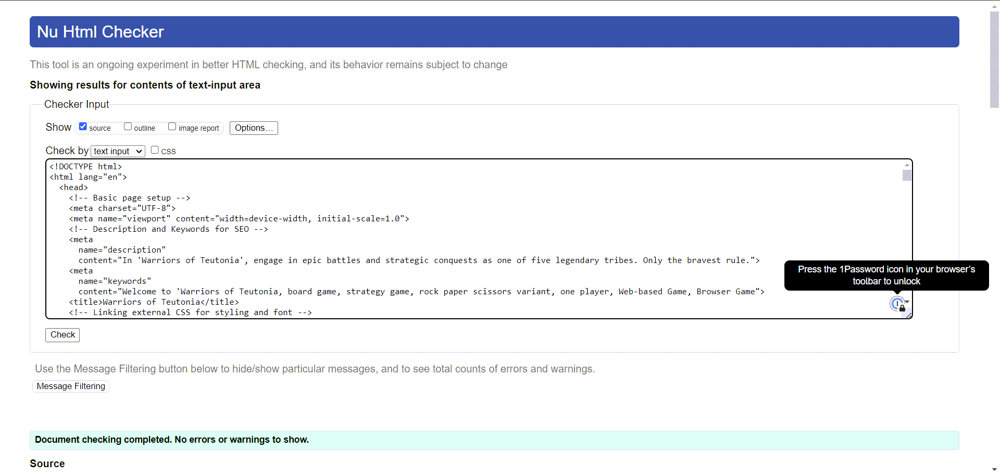
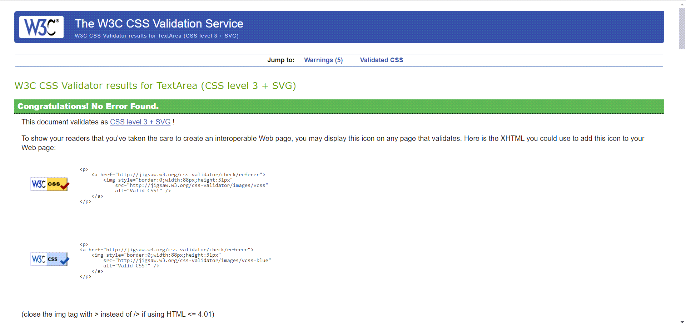
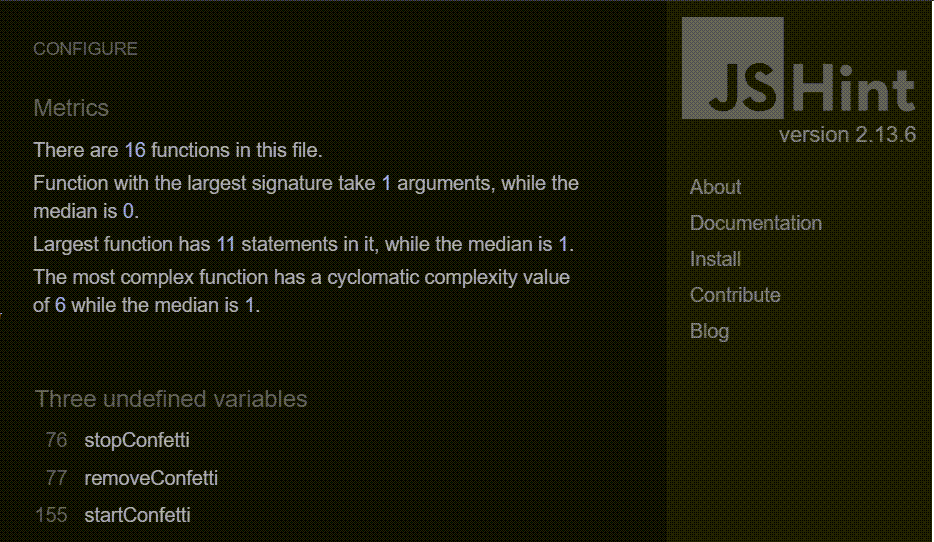
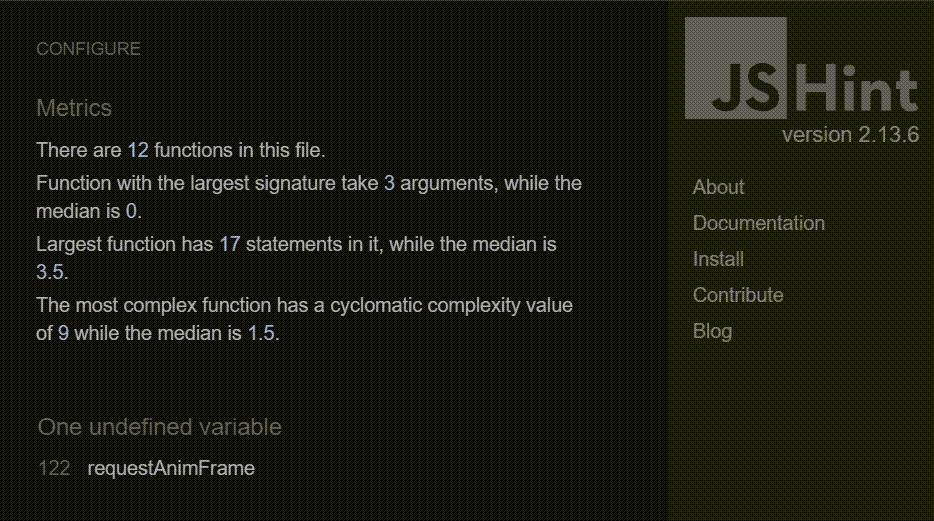
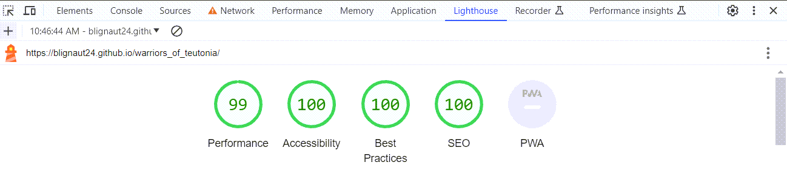

# [TESTING.md](http://TESTING.md)

## Code Validation

------

All code for the site has been tested thoroughly.

- All HTML code has been run through the W3C HTML Validator

  - A no warnings were presented when testing the HTML code.

- All CSS code has been run through the W3C CSS Validator

  - No warnings or errors were presented when testing the CSS code.

- All JavaScript code has been run through JSHint

  

  - Warnings from JavaScript code are due to scripts being loaded before they are read, hence they are not unused.

After making the necessary adjustments to the code, no errors or warnings were presented.


### W3C HTML Validator Final Results



### W3C CSS Validator Final Results


### JSHint Final Results

#### 	Main Script (script.js)


#### 	Confetti.js
 


## Responsiveness

------

The site was tested for responsiveness throughout the development phase using [Google Chrome Devtools](https://developer.chrome.com/docs/devtools/) and the [Polypane](https://polypane.app/).

I tested the site across multiple screen sizes used by different devices and the site worked and was displayed as intended across all the screen sizes.

Some of the screen sizes used for testing were:

- iPhone 5
- iPhone8
- iPhone11
- iPhone Pro Max
- iPhone 12/ 12 Pro
- iPad 7th gen
- iPad Pro 11 inch
- iPad Pro 12 inch
- Galaxy S9
- Laptop 1280 x 800px

## Browser Compatibility

------

The site was tested on the following browsers:

- Google Chrome
- Microsoft Edge
- Safari

I did not come across any problems on any of these browsers and the functionality and appearance remained consistent.

## Testing User Stories

------

In our testing, we ensured that the game met all of the following user requirements:

- Provides an engaging single-player experience based on chance.
  - The game mechanics are based on the popular game Rock, Paper, Scissors, Lizard, Spock.
- Offers a unique, yet simple and straightforward game similar to rock paper scissors.
  - The game's log has been upgraded from the basic Rock, Paper, Scissors to include Lizard and Spock, enhancing the overall user experience.
- Creates an immediate desire to play as soon as the page loads.
  - The game initiates instantly upon loading with a minimalistic design featuring essential menus and buttons. The game follows a 'plug and play' design philosophy.
- Features a user-friendly interface that's easy to navigate.
  - The chosen design for this application enhances the user interface.
- Has clear rules and easy-to-understand gameplay mechanics.
  - A modal is utilized to present the game logic in a cutom diagram and bullet points, making the gameplay mechanics easy to understand.
- Gives instant feedback on game results (win, loss, or draw).
  - Players are provided with immediate feedback through written result text and a celebratory confetti drop when they win.
- Keeps a score tally during gameplay.
  - In the game, a score tally feature is incorporated to keep track of the number of rounds won by both the player and the computer.

## Known Bugs

------

Two bugs proved to be particularly challenging to resolve.

### Known Issue: CSS Root Color Application

We're currently experiencing an issue with the application of CSS root colors. The bug surfaces when trying to alter the background font to the primary color as defined in the root. Despite this change, the expected transformation does not occur.

Here is a code snippet related to the issue:

```css
/* general styles */
:root{
    /* fonts */
    --title: 'Alegreya',serif;
    --sub-title: 'Forum',serif;
    --main-font:'Martel',serif;

    /* colors */
    --background: #F5F5F5;
    --primary: ##d8a66c;
    --info: #242335
    --success: #76ac58;
    --warning: #f39c20;
    --danger: #f44336;

    /* utils */
};

body {
    margin: 0;
    min-height: 100vh;
    background-color: var(--primary);
    display: flex;
    justify-content: center;
    align-items: center;
}
```

The issue is within the 'body' style where 'background-color' is set to 'var(--primary)'. This should change the background color to the primary color defined in the root; however, the change is not taking effect as expected.

Our team is currently investigating this bug to provide a resolution. Any changes due to this issue will involve modifications to the 'assets/css/style.css' and 'index.html' files.

### Known Issue: Module Specifier in JavaScript

A bug was identified in the JavaScript file that resulted in a console error message, 'Uncaught TypeError: Failed to resolve module specifier "assets/js/confetti.js". Relative references must start with either "/", "./", or "../"'. This issue was preventing the JavaScript from functioning as expected.

Reproduction Steps:

1. Setup the game.
2. Select player and computer.
3. Attempt to reset all functions and trigger the confetti functionality.

Expected Outcome: The 'confetti.js' file should import successfully, allowing the JavaScript functions to operate as intended.

Actual Outcome: The console registered an error about failing to resolve the module specifier, causing the JavaScript to malfunction.

Proposed Solution: We recommend reviewing and correcting the path to the 'confetti.js' file as necessary. Ensure the path begins with './' if the file is in the same directory as the script importing it, or '../' if it's located in a parent directory.

We are currently on the 'main' branch, which is up to date with 'origin/main'. Pending changes include modifications to 'assets/css/style.css', 'assets/js/confetti.js', 'assets/js/script.js', and 'index.html'.

## Additional Testing

------

### Lighthouse

I used the [Google lighthouse](https://developer.chrome.com/docs/lighthouse/overview/) test in Chrome Developer Tools to test the site in the following categories.

- Performance
- Accessibility
- Best Practices
- SEO

The results I obtained were very good.




### Peer Review

The general feedback received was favorable, and no recommendations for improving the app were offered. However, it's important to note that this conclusion was drawn from a small number of reviews.

[Link to README.md](README.md)